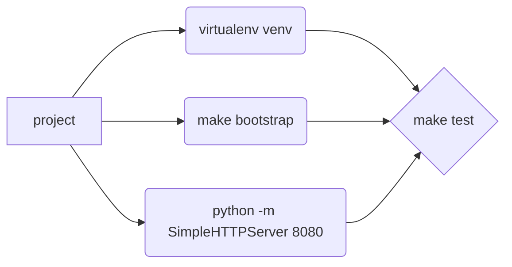
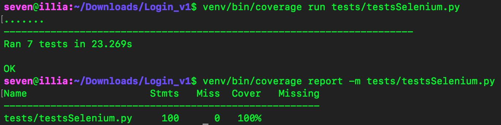

# Selenium tests

Este proyecto trata de hacer una página web con cierta funcionalidad y hacer tests usando **Selenium**.

Esta web deberá de tener un formulario muy sencillo con:
-   Un textfield en el que podrás escribir un texto libre (máximo 100 caracteres)
-   Dos botones:
    -   Reset: borra todo lo que haya en el textfield
    -   Execute: Arranca el proceso que habéis hecho de cálculo de palabras▪
-   Un textfield/lista/lo que queráis que muestre las palabras y el número de apariciones de las mismas

El funcionamiento de la web es sencillo:

-   Un usuario (no hace falta login/registro/etc) puede introducir cualquiertexto en el textfield (con un máximo de 100 caracteres)
-   Si el usuario pulsa el botón Reset todo el texto que haya en textfield deberá de desaparecer. En caso de que no hubiera texto escrito el botón Reset no deberá de hacer nada.
-   Si el usuario pulsa el botón Execute y hay texto, la web deberá de mostrar por pantalla un listado con las palabras y el número de apariciones ordenadas de mayor a menor y, de igual forma, deberá de borrarse el texto que aparece en el textfield. En caso de que no hubiera ningún texto el botón no tendrá ningún efecto.

## Organización del proyecto

Para montar el proyecto y hacer las pruebas no nos debemos mover de la carpeta principal, que contiene:
 - tests
    -   En esta carpeta almacenaremos los scripts con los tests que vamos a probar, en nuestro caso tenemos testsSelenium.py
 - www
	 -  En esta carpeta es donde están los archivos de la web: html, css, js...
 - venv
	 - Esta carpeta contiene el entorno virtual de python que vamos a necesitar para almacenar una configuración concreta, más adelante mostraremos como crearla.
  
## Preparación del entorno

Primero debemos crear nuestro entorno virtual, para ello vamos a ejecutar el siguiente comando:
```bash
virtualenv venv
```
Esto creará la carpeta venv en el directorio principal.

Ahora debemos instalar las dependencias de el proyecto, para ello ejecutamos:
```bash
make bootstrap
```
Está casi todo preparado para poder pasar los tests; estamos probando páginas web, así que tenemos que levantar la web.
Para ello ejecutamos el comando:
```bash
python -m SimpleHTTPServer 8080
```
Este comando sirve para levantar el servidor con la página web.
Realmente está sirviendo la carpeta principal, pero los tests están configurados para acceder a la ruta www/.
Para acceder a la página web:
http://localhost:8080/www/

## Ejecución de los tests

Una vez que hemos configurado el entorno, instalado las dependencias y levantado el servidor, para pasar los test debemos ejecutar el comando:
```bash
make test
```

Sin embargo, si no queremos levantar a mano el servidor en python, podemos ejecutar el siguiente comando, que levantará y cerrará el servidor por nosotros:
```bash
make testAutoServer
```
Este último comando solo funciona en sistemas Linux y OsX.



## Coverage

